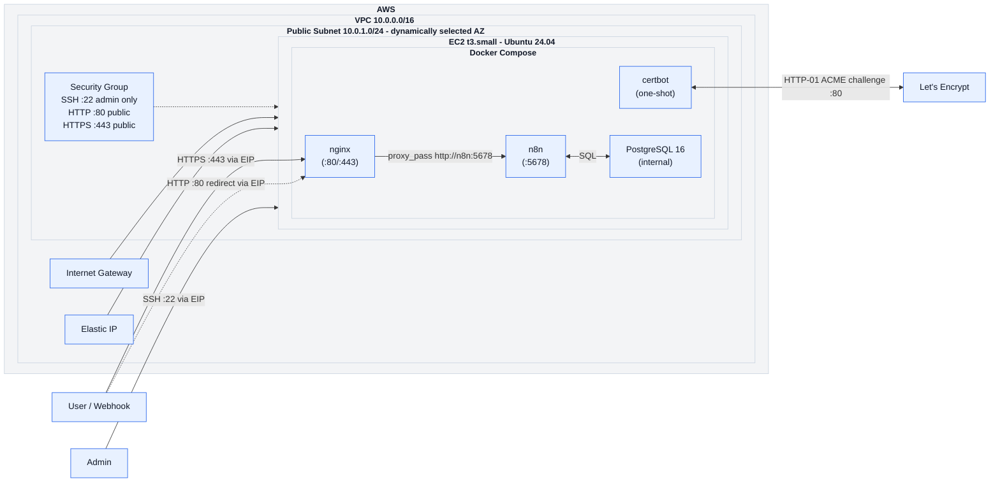
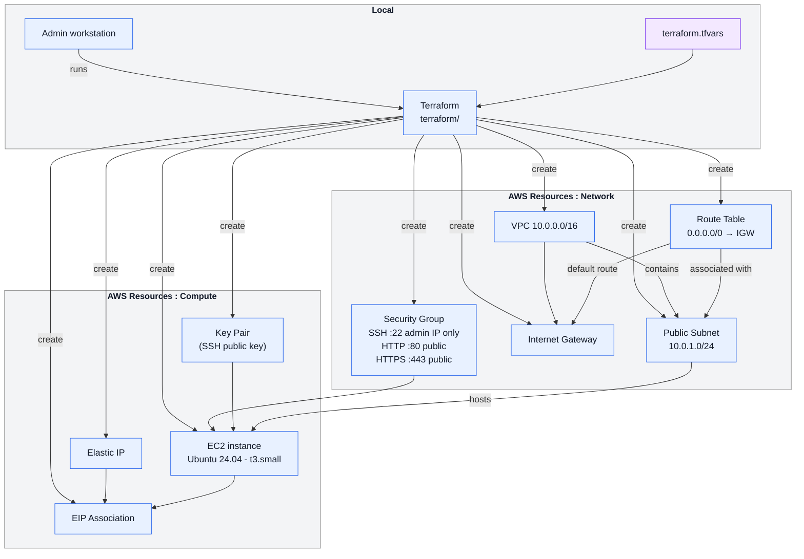

# n8n-deploy-kit

n8n-deploy-kit is a lightweight tool for setting up a self-hosted [n8n](https://n8n.io) stack on AWS EC2 quickly. The infrastructure is provisioned with Terraform and then configured with Ansible, with secure infrastructure settings (IMDSv2 enforced, SSH restricted to admin IP, encrypted EBS root volume.)

Once provisioned, the stack runs nginx, certbot, n8n and PostgreSQL as Docker Compose services. nginx handles TLS termination with an initial Let's Encrypt certificate and proxies traffic to n8n via the Docker internal network. The n8n interface is accessible via HTTPS at a URL automatically derived from the EC2 public IP using sslip.io, for example `https://51-45-52-249.sslip.io`. No DNS configuration is required.

## Prerequisites

- Terraform >= 1.14
- Ansible >= 2.15
- AWS CLI >= 2 configured (`aws configure`)
- An SSH key pair dedicated to this project

**Generate a dedicated SSH key pair:**
```bash
ssh-keygen -t ed25519 -f ~/.ssh/n8n-deploy-kit_key -N "" -C "n8n-deploy-kit"
```

**Detect your public IP for SSH access:**
```bash
curl -s https://ifconfig.me
```

**Configure your variables, copy the example and fill in the values:**
```bash
cp terraform/terraform.tfvars.example terraform/terraform.tfvars
```

Required values in `terraform.tfvars`:

| Variable         | Description                                             |
| ---------------- | ------------------------------------------------------- |
| `admin_ip`       | Your public IP with /32 suffix (e.g. `203.0.113.10/32`) |
| `aws_region`     | AWS region                                              |
| `instance_type ` | AWS instance type for EC2 (t3.small by default)         |
| `ssh_public_key` | Content of `~/.ssh/n8n-deploy-kit_key.pub`              |

**Set your email address for Let's Encrypt notifications** in `ansible/playbook.yml`:

```yaml
vars:
  certbot_email: "your@email.com"
```

---

## Provision the AWS infrastructure (Terraform)

Terraform provisioning :
```bash
terraform -chdir=terraform init
terraform -chdir=terraform apply -auto-approve
```

If needed you can retrieve the EC2 public IP and the ssh command to join the instance :

```bash
# EC2 public IP
terraform -chdir=terraform output ec2_public_ip

# Ready-to-use SSH command
terraform -chdir=terraform output ssh_command
```

Generate the ansible inventory :
```bash
# Ansible inventory (generated from Terraform outputs)
terraform -chdir=terraform output -raw ansible_inventory > ansible/inventory.ini
```

---

## Tools deployment and configuration (Ansible)

```bash
ansible-playbook -i ansible/inventory.ini ansible/playbook.yml
```

The playbook runs the following roles in order:

| Role | What it does |
|---|---|
| `base` | System updates and package cleanup |
| `docker` | Installs Docker Engine and Compose plugin, verifies GPG fingerprint |
| `nginx` | Deploys nginx and certbot bootstrap, obtains the initial Let's Encrypt TLS certificate, configures HTTPS placeholder |
| `n8n` | Generates secrets, deploys n8n and PostgreSQL, switches nginx to the final reverse proxy config |

> **Note**: the first run may take 3–5 minutes on a t3.small while n8n applies its database migration.

**Validate the deployment:**

```bash
# Check HTTPS response (run locally)
curl -Ik https://<EC2 public IP with hyphens>.sslip.io

# Check container status (run on the EC2 instance)
docker compose -f /opt/n8n/docker-compose.yml ps
```

Expected result: curl returns the `200 OK`. The `nginx`, `n8n` and `postgres` containers should be running. The `certbot` container is used as a one-shot service and is not expected to stay running. 

Open `https://<EC2 public IP with hyphens>.sslip.io` in a browser to complete the n8n initial setup.

---

## Destroy Infrastructure

```bash
terraform -chdir=terraform destroy -auto-approve
```

> **Warning**: always destroy the infrastructure before deleting the repository
> or the `terraform/terraform.tfstate` file. Terraform needs its state to know what
> resources to delete. If the state is lost while resources are still running,
> they will continue to incur AWS charges and must be deleted manually from
> the AWS console.

---

## Architecture

High-level view of the target architecture and the main network flows.



The architecture includes:

* An Ubuntu 24.04 EC2 instance (`t3.small`) hosting the full stack.
* **nginx** running in Docker Compose as a reverse proxy, handling TLS termination and proxying traffic to n8n via the Docker internal network.
* **certbot** running as a one-shot Docker Compose service, obtaining the initial Let's Encrypt TLS certificate via the HTTP-01 ACME challenge. Certificate renewal is not yet automated.
* **n8n** running in Docker Compose, accessible only from nginx via the Docker internal network (`http://n8n:5678`).
* **PostgreSQL 16** running in Docker Compose as n8n's database backend (no public port exposed).
* An **Elastic IP** ensuring the public IP address remains stable across instance reboots.
* **IMDSv2 enforced** with hop limit = 1, preventing Docker containers from accessing the instance metadata service.
* **Encrypted EBS volume** (gp3) for the root disk.

---

## Terraform provisioning workflow



---

## Security

Currently implemented at the Terraform layer:

* **SSH restricted to `admin_ip`** via the Security Group (port 22 allowed only from your `/32`).
* **EC2 key pair authentication** for the Ubuntu instance.
* **IMDSv2 enforced**: instance metadata access requires a session token (IMDSv1 disabled). Hop limit set to 1 - Docker containers cannot reach the metadata service.
* **Encrypted EBS root volume**: disk content is encrypted at rest using an AWS-managed key.

Currently implemented at the Ansible / application layer:

* **nginx as the only public entry point**: ports 80 and 443 are the only publicly exposed ports.
* **n8n not directly exposed**: n8n is reachable only from nginx via the Docker internal network.
* **PostgreSQL not exposed**: no public port, reachable only by n8n within the Docker Compose network.
* **Let's Encrypt TLS certificate** obtained via certbot with HTTP-01 challenge at provisioning time.
* **Docker GPG key fingerprint verified** during installation 
* **nginx container hardened**: `cap_drop: ALL`, `read_only: true`, `no-new-privileges`.
* **n8n secrets generated automatically**: PostgreSQL password and encryption key are randomly generated by Ansible on first deploy and never stored in the repository.
* **`.env` file permissions**: `0600` , readable only by the `ubuntu` user on the EC2 instance.

---

## Repository structure

```text
n8n-deploy-kit/
├── ansible.cfg                 # Ansible configuration (SSH key, inventory path)
├── ansible/
│   ├── inventory.ini               # Generated by Terraform output (gitignored)
│   ├── playbook.yml                # Main playbook , orchestrates all roles
│   └── roles/
│       ├── base/
│       │   └── tasks/main.yml      # System update and cleanup
│       ├── docker/
│       │   └── tasks/main.yml      # Docker Engine + Compose plugin installation
│       ├── nginx/
│       │   ├── tasks/main.yml      # nginx + certbot deployment and TLS configuration
│       │   └── templates/
│       │       ├── nginx-http-only.conf.j2          # HTTP config for ACME challenge
│       │       └── nginx-https-placeholder.conf.j2  # HTTPS config before n8n deployment
│       └── n8n/
│           ├── tasks/main.yml      # n8n + PostgreSQL deployment, final nginx config
│           └── templates/
│               ├── .env.j2         # n8n and PostgreSQL secrets template
│               └── nginx.conf.j2   # Final HTTPS config with n8n proxy
├── docker/
│   ├── docker-compose.yml          # Full stack: nginx, certbot, n8n, PostgreSQL
│   └── .env.example                # Environment variables reference (no secrets)
├── terraform/
│   ├── compute.tf                  # EC2, EIP, key pair
│   ├── network.tf                  # VPC, subnet, IGW, route table, security group
│   ├── outputs.tf                  # Public IP, SSH command, Ansible inventory
│   ├── variables.tf                # Input variables with defaults
│   ├── versions.tf                 # Terraform and provider version constraints
│   ├── terraform.tfvars.example    # Variables template (commit-safe)
│   └── terraform.tfvars            # Actual values - gitignored, never committed
├── .gitignore
└── README.md
```

Note: the following files are local-only and intentionally ignored by Git:

* `terraform/terraform.tfstate*` and `terraform/.terraform/` - Terraform state and provider cache.
* `terraform/terraform.tfvars` - sensitive variable values (admin IP, SSH public key).
* `ansible/inventory.ini` - generated from Terraform outputs, contains the EC2 IP address.

The SSH private key is expected to stay outside the repository, for example in `~/.ssh/n8n-deploy-kit_key`.

---

## Future improvements

* **n8n owner pre-configuration** - Pre-create the admin account via environment variables so the instance is locked down as soon as it comes online.
* **Certificate renewal** - Automate Let's Encrypt certificate renewal via a systemd timer running `certbot renew` and reloading nginx.
* **Queue mode** - Redis + n8n workers for high-volume, parallel workflow execution.
* **RDS PostgreSQL** - Replace the containerized PostgreSQL with a managed AWS RDS instance and automated S3 backups.
* **Monitoring** - Prometheus + Grafana for n8n metrics and system observability.
* **HIPAA hardening** - Encryption at rest, audit logging, network isolation checklist.
* **Multi-tenant** - Per-client n8n instances with Terraform modules.
* **Remote Terraform backend** - S3 + DynamoDB state locking for team use.
