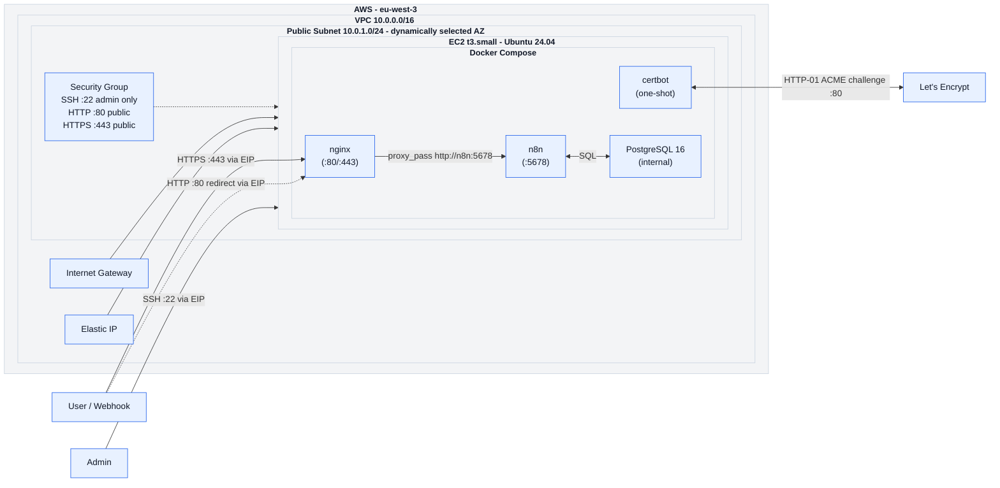
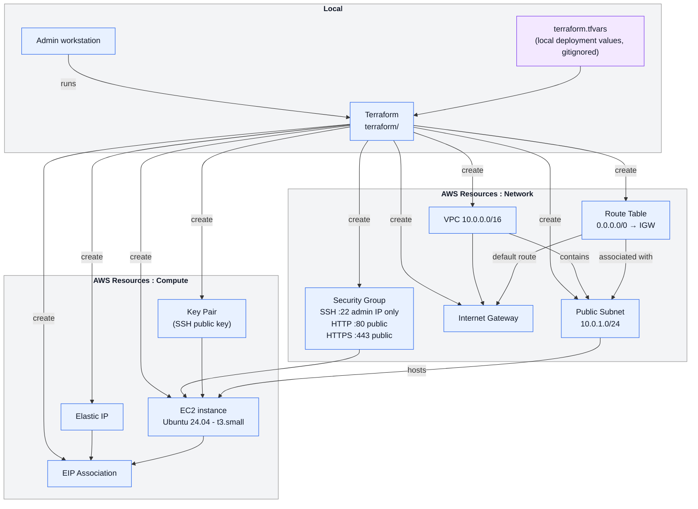

# n8n-deploy-kit

- AWS infrastructure provisioned with Terraform.
- Secure defaults: IMDSv2 enforced, SSH restricted to an admin IP, encrypted EBS root volume.
- Docker, nginx and certbot fully provisioned via Ansible. n8n deployment in progress.

n8n-deploy-kit is a production-oriented proof of concept for deploying a self-hosted [n8n](https://n8n.io) stack on AWS EC2.

The current version provisions the AWS infrastructure and configures the full Docker Compose stack with nginx, certbot and a Let's Encrypt TLS certificate. At this stage, `https://<fqdn>` responds with a voluntary `502 — n8n is not deployed yet` — this is expected. n8n and PostgreSQL deployment is in progress.

The target v1 stack runs nginx, certbot, n8n and PostgreSQL as Docker Compose services, with nginx handling TLS termination and proxying traffic to n8n via the Docker internal network.

## Prerequisites

- Terraform >= 1.14
- Ansible >= 2.15
- AWS CLI >= 2 configured (`aws configure`)
- An SSH key pair dedicated to this project

> **No custom domain required for the POC.** The public FQDN is generated dynamically from the Elastic IP using [sslip.io](https://sslip.io) — for example `51-45-52-249.sslip.io`. This is suitable for development and testing. A real domain would be required for a production deployment or client demo.

**Generate a dedicated SSH key pair:**
```bash
ssh-keygen -t ed25519 -f ~/.ssh/n8n-deploy-kit_key -N "" -C "n8n-deploy-kit"
```

**Detect your public IP for SSH access:**

```bash
curl -s https://ifconfig.me
```

**Configure your variables - copy the example and fill in the values:**

```bash
cp terraform/terraform.tfvars.example terraform/terraform.tfvars
```

Required values in `terraform.tfvars`:

| Variable         | Description                                             |
| ---------------- | ------------------------------------------------------- |
| `admin_ip`       | Your public IP with /32 suffix (e.g. `203.0.113.10/32`) |
| `ssh_public_key` | Content of `~/.ssh/n8n-deploy-kit_key.pub`              |

---

## Provision the AWS infrastructure

```bash
terraform -chdir=terraform init
terraform -chdir=terraform apply -auto-approve
```

After apply, retrieve the outputs:

```bash
# EC2 public IP
terraform -chdir=terraform output ec2_public_ip

# Ready-to-use SSH command
terraform -chdir=terraform output ssh_command

# Ansible inventory (generated from Terraform outputs)
terraform -chdir=terraform output -raw ansible_inventory > ansible/inventory.ini
```

---

## Configure the stack

```bash
ansible-playbook -i ansible/inventory.ini ansible/playbook.yml
```

The playbook runs the following roles in order:

| Role | What it does |
|---|---|
| `base` | System updates and package cleanup |
| `docker` | Installs Docker Engine and Compose plugin, verifies GPG fingerprint |
| `nginx` | Deploys Docker Compose stack, obtains Let's Encrypt TLS certificate via certbot, configures nginx |

---

## Destroy

```bash
terraform -chdir=terraform destroy -auto-approve
```

> **Warning**: always destroy the infrastructure before deleting the repository
> or the `terraform/terraform.tfstate` file. Terraform needs its state to know what
> resources to delete. If the state is lost while resources are still running,
> they will continue to incur AWS charges and must be deleted manually from
> the AWS console.

---

## Architecture

High-level view of the target architecture and the main network flows.



The following components describe the intended v1 target architecture. At the current stage, Terraform provisions the AWS infrastructure and Ansible configures Docker, nginx and certbot. n8n and PostgreSQL deployment is in progress.

The target architecture includes:

* An Ubuntu 24.04 EC2 instance (`t3.small`) hosting the full stack.
* **nginx** running in Docker Compose as a reverse proxy, handling TLS termination and proxying traffic to n8n via the Docker internal network.
* **certbot** running as a one-shot Docker Compose service, obtaining and renewing Let's Encrypt TLS certificates via the HTTP-01 ACME challenge.
* **n8n** running in Docker Compose, accessible only from nginx via the Docker internal network (`http://n8n:5678`).
* **PostgreSQL 16** running in Docker Compose as n8n's database backend (no public port exposed).
* A **Let's Encrypt TLS certificate** obtained via certbot, with automatic renewal managed by a systemd timer.
* An **Elastic IP** ensuring the public IP address remains stable across instance reboots.
* **IMDSv2 enforced** with hop limit = 1, preventing Docker containers from accessing the instance metadata service.
* **Encrypted EBS volume** (gp3) for the root disk.

---

## Terraform provisioning workflow



---

## Security

Currently implemented at the Terraform layer:

* **SSH restricted to `admin_ip`** via the Security Group (port 22 allowed only from your `/32`).
* **EC2 key pair authentication** for the Ubuntu instance.
* **IMDSv2 enforced**: instance metadata access requires a session token (IMDSv1 disabled). Hop limit set to 1 - Docker containers cannot reach the metadata service.
* **Encrypted EBS root volume**: disk content is encrypted at rest using an AWS-managed key.

Currently implemented at the Ansible / application layer:

* **nginx as the only public entry point**: ports 80 and 443 are the only publicly exposed ports.
* **n8n not directly exposed**: n8n is reachable only from nginx via the Docker internal network.
* **PostgreSQL not exposed**: no public port, reachable only by n8n within the Docker Compose network.
* **Let's Encrypt TLS certificate** obtained via certbot with HTTP-01 challenge, renewed automatically via a systemd timer.
* **Docker GPG key fingerprint verified** during installation to prevent supply chain attacks.
* **nginx container hardened**: `cap_drop: ALL`, `read_only: true`, `no-new-privileges`.

Planned:

* **n8n deployment** - Docker Compose service configuration and environment variables.
* **CSP and X-Frame-Options headers** - deferred until n8n UI compatibility is validated.

---

## Repository structure

```text
n8n-deploy-kit/
├── ansible.cfg                 # Ansible configuration (SSH key, inventory path)
├── ansible/
│   ├── inventory.ini               # Generated by Terraform output (gitignored)
│   ├── playbook.yml                # Main playbook — orchestrates all roles
│   └── roles/
│       ├── base/
│       │   └── tasks/main.yml      # System update and cleanup
│       ├── docker/
│       │   └── tasks/main.yml      # Docker Engine + Compose plugin installation
│       └── nginx/
│           ├── tasks/main.yml      # nginx + certbot deployment and TLS configuration
│           └── templates/
│               ├── nginx-http-only.conf.j2          # HTTP config for ACME challenge
│               ├── nginx-https-placeholder.conf.j2  # HTTPS config before n8n deployment
│               └── nginx.conf.j2                    # Final HTTPS config with n8n proxy (phase 8)
├── docker/
│   └── docker-compose.yml          # Full stack: nginx, certbot, n8n, PostgreSQL
├── docs/                           # Architecture documentation (planned)
├── terraform/
│   ├── compute.tf                  # EC2, EIP, key pair
│   ├── network.tf                  # VPC, subnet, IGW, route table, security group
│   ├── outputs.tf                  # Public IP, SSH command, Ansible inventory
│   ├── variables.tf                # Input variables with defaults
│   ├── versions.tf                 # Terraform and provider version constraints
│   ├── terraform.tfvars.example    # Variables template (commit-safe)
│   └── terraform.tfvars            # Actual values - gitignored, never committed
├── .gitignore
└── README.md
```

Note: the following files are local-only and intentionally ignored by Git:

* `terraform/terraform.tfstate*` and `terraform/.terraform/` - Terraform state and provider cache.
* `terraform/terraform.tfvars` - sensitive variable values (admin IP, SSH public key).
* `ansible/inventory.ini` - generated from Terraform outputs, contains the EC2 IP address.
* `.ssh/n8n-deploy-kit_key` and `.ssh/n8n-deploy-kit_key.pub` - SSH key pair used for deployment.

---

## Future improvements

* **n8n deployment** - Docker Compose environment variables, encryption key, PostgreSQL connection (in progress).
* **Queue mode** - Redis + n8n workers for high-volume, parallel workflow execution.
* **RDS PostgreSQL** - Replace the containerized PostgreSQL with a managed AWS RDS instance and automated S3 backups.
* **Monitoring** - Prometheus + Grafana for n8n metrics and system observability.
* **HIPAA hardening** - Encryption at rest, audit logging, network isolation checklist.
* **Multi-tenant** - Per-client n8n instances with Terraform modules.
* **Remote Terraform backend** - S3 + DynamoDB state locking for team use.
